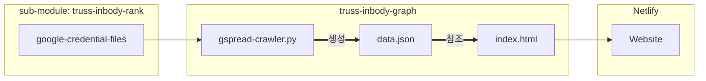

# Truss Inbody Graph

이 repository는 Truss 사람들의 인바디 점수를 그래프로 보여주는 웹사이트의 소스 코드를 담고 있습니다.

## 웹사이트 구조

웹사이트의 그래프는 [Highcharts](https://www.highcharts.com)를 이용하여 그렸습니다.

1. Credential 파일
2. 얽어 옴
3. data json 업데이트
4. 참조하여 index.html이 그래프 그림
5. index.html을 Netlify에서 배포해줌

## 코드 구조

- .github/workflows -> GitHub Actions 파일. 매일 자동으로 gspread-crawler를 동작시킨다.
- submodule repository
- data.json
- gspread-crawler.py
- index.html --> https://www.highcharts.com
- style.css