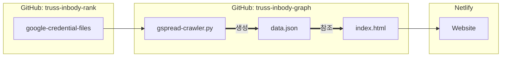

# Truss Inbody Graph

이 repository는 Truss 사람들의 인바디 점수를 그래프로 보여주는 웹사이트의 소스 코드를 담고 있습니다.

## 웹사이트 구조

GitHub repository의 파일들을 [Netlify](https://www.netlify.com)를 통해 host하는 방식입니다.

1. `truss-inbody-rank`라는 외부에 공개되지 않는 repository에는 인증 파일들이 저장되어 있습니다. 이 파일들은 Google Spreadsheet 데이터에 접근하기 위해 필요합니다.
2. `gspread-crawler.py`가 Google Spreadsheet의 데이터를 읽어서 `data.json`에 저장합니다. 이 과정에서 위에서 언급했던 인증 파일들이 사용됩니다.
3. `data.json`에 저장된 데이터를 기반으로 `index.html`에서 그래프를 그립니다. 그래프는 [Highcharts](https://www.highcharts.com)의 템플릿을 이용하여 그렸습니다.
4. Netlify에서 `index.html`를 비롯한 여러 파일들을 인터넷 상에 배포합니다.
